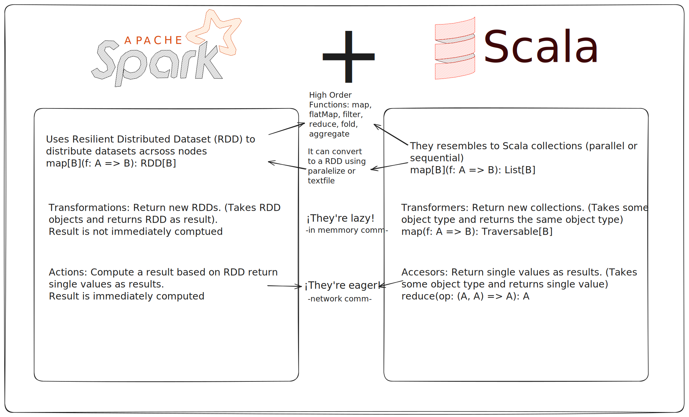
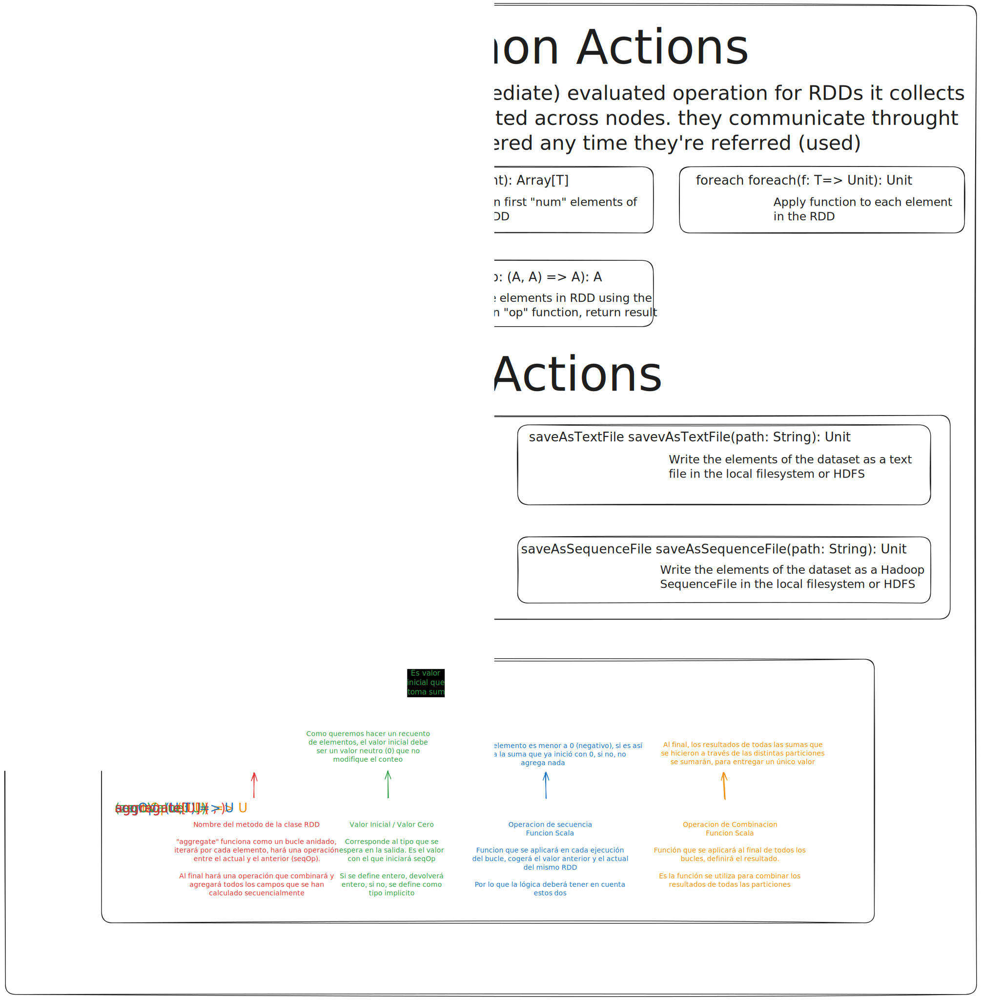
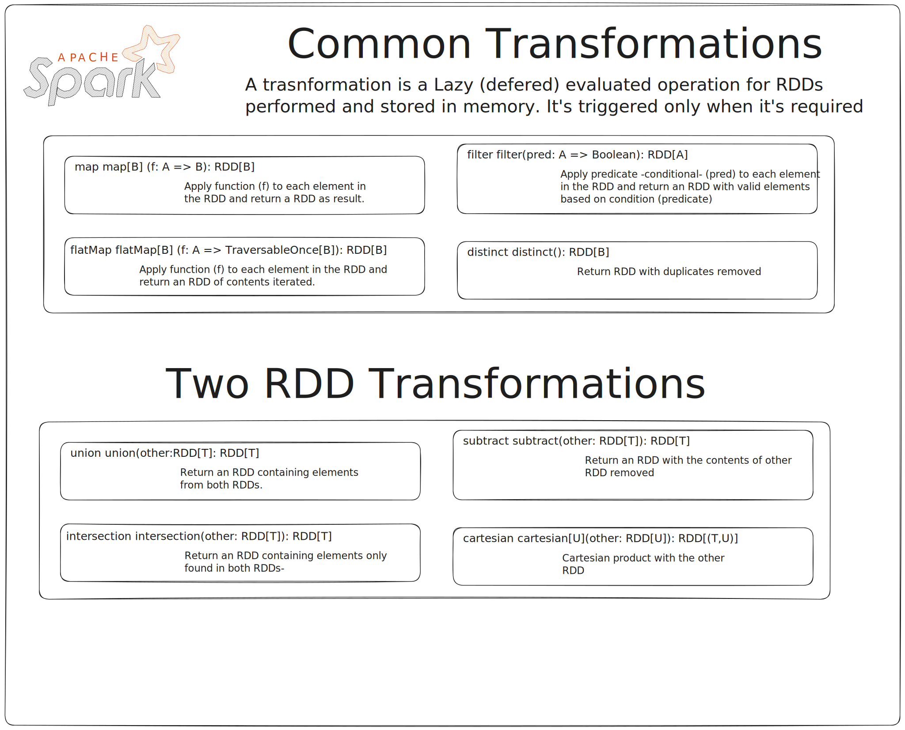

# Spark + Scala Learning Notes

## Table of Contents

- [Spark + Scala Learning Notes](#spark--scala-learning-notes)
  - [Table of Contents](#table-of-contents)
  - [About ](#about-)
  - [Repository Content ](#repository-content-)
  - [Learning Notes](#learning-notes)
    - [Similarities](#similarities)
    - [Common Actions](#common-actions)
    - [Common Transformations](#common-transformations)
  - [Repository Structure](#repository-structure)
  - [Requirements](#requirements)
  - [How to Contribute](#how-to-contribute)
  - [Additional Resources](#additional-resources)
  - [License](#license)

## About 

This repository is dedicated to my practice and notes as I learn **Spark + Scala** by following some **Coursera** and other courses & resources. Here, I will store the code for the course projects as well as my learning notes.

## Repository Content 

1. **Learning Notes**  
   - I have created an **Excalidraw** file with my visual notes and summaries of the concepts learned throughout the course.
   - The notes file is located in the `notes/` folder.

2. **Course Projects**  
   - Throughout the course, I will complete various projects, which I will download and upload here.
   - The projects will be organized into separate folders within the repository.

## Learning Notes

As part of my learning process, I've made visual notes using Excalidraw. You can view an image of the notes below:
### Similarities

### Common Actions

### Common Transformations

For more detailed notes, check out the Excalidraw file [here](notes/notes.excalidraw).

## Repository Structure

📦Scala Learning

 ┣ 📂notes

 ┃ ┗ [📜notes.excalidraw](notes/notes.excalidraw)

 ┣ 📂base-project-template ..

 ┣ 📂big-data-1st-assignment ..

 ┣ 📂big-data-2nd-assignment ..

 ┗ [📜README.md](README.md)
 

## Requirements

To run the projects, make sure you have the following installed:

- [Scala](https://www.scala-lang.org/download/)
- [sbt (Scala Build Tool)](https://www.scala-sbt.org/download.html)
- [Metals - Visual Studio Code](https://scalameta.org/metals/docs/editors/vscode/)

## How to Contribute

This repository is primarily for educational purposes. However, if you have suggestions or improvements, feel free to open an **issue** or a **pull request**.

## Additional Resources

- [Big Data Analysis with Scala and Spark](https://www.coursera.org/learn/scala-spark-big-data)
- [Official Scala Documentation](https://docs.scala-lang.org/)
- [Scala + Spark Documentation](https://spark.apache.org/docs/latest/api/scala/org/apache/spark/index.html) 

## License

This project is licensed under the MIT License - see the [LICENSE](LICENSE) file for details.

---

I hope you find this repository useful and enjoy learning Scala!
